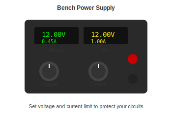
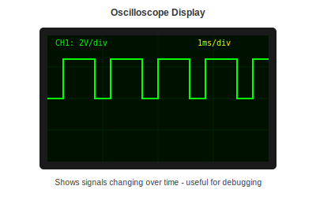

# Additional Tools

Nice-to-have equipment for when you are ready to expand.

---

## Overview

These are tools you do not need to start, but you will probably want eventually. Listed roughly in order of usefulness.

---

## Bench Power Supply

Lets you power circuits at any voltage and limit current to protect against mistakes.

**Why you want it:** Instead of hunting for the right wall adapter, you dial in exactly what you need.

**Recommended:** Korad KA3005D (about $80) - Complete unit, 30V/5A

---

## Oscilloscope

Shows you electrical signals over time. Essential for debugging timing issues and communication protocols.

**Why you want it:** When things are not working and you need to see what is actually happening.

**Recommended:** FNIRSI 1014D (about $90) - Standalone, no computer needed

---

## Better Microscope

The USB microscopes are good, but a proper stereo microscope has no lag and better depth perception.

**Why you want it:** Makes fine work much less frustrating.

**Recommended:** Andonstar AD407 (about $140) - 4K, 7 inch screen

---

## Thermal Camera

Shows you where heat is building up in a circuit.

**Why you want it:** Finding components that are running too hot, or shorts that are heating up.

**Recommended:** TOPDON TC001 (about $220) - USB-C, works with phone or computer

---

## Reflow Setup

For assembling surface mount boards with solder paste.

**What you need:**
- Solder paste
- Stencil (order with your PCBs)
- Hot plate or reflow oven

**Budget option:** Hot plate (about $30) - Manual control, watch carefully

**Better option:** T962 Reflow Oven (about $130) - Automated temperature profile

---

## 3D Printer

For making enclosures and custom parts.

**Why you want it:** Custom cases, mounting brackets, tool holders.

**Recommended:** Bambu Lab A1 Mini (about $280) - Fast, reliable, minimal fiddling

---

## Component Storage

As your collection grows, you need somewhere to put it all.

**Options:**
- SMD component books (about $15) - Pages with pockets for SMD parts
- Parts cabinet (about $50) - Many small drawers
- Labeled bags in a box - Cheap and works

---

## Connector Kits

Eventually you will need to make custom cables.

**Useful kits:**
- Dupont connectors ($15) - For breadboard jumpers
- JST connectors ($15) - For battery connections
- Crimping tool ($25-40) - To attach connectors to wire

---

## Priority Order

If you are building up over time:

1. **Bench power supply** - Immediately useful
2. **Component storage** - Keeps you organized
3. **Oscilloscope** - When you need to debug complex projects
4. **Better microscope** - When USB microscope frustrates you
5. **Everything else** - As specific needs arise

---

## Total Investment Guide

| Level | Budget | What You Get |
|-------|--------|--------------|
| Basic additions | $100-150 | Power supply, storage |
| Solid upgrade | $300-400 | Above plus oscilloscope |
| Full workshop | $700-900 | Above plus thermal camera, reflow |

---

[Back to Workstation Setup](workstation-setup.md) | [Soldering Basics](../02-SKILLS/soldering-basics.md)
