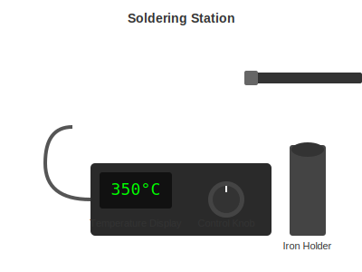

# Essential Tools

Everything you need for a complete electronics workspace, organized by priority.

---

## The Heart of Your Workshop: Soldering Station

This is where you should spend your money. A good soldering station makes everything easier. A bad one makes everything frustrating.



### What to Look For

- Temperature control (not just high/medium/low)
- Heats up in under 30 seconds
- Comfortable to hold
- Replacement tips available

### Our Recommendations

| Budget | Product | Price | Notes |
|--------|---------|-------|-------|
| Starter | KSGER T12 | $45-60 | Best value for beginners |
| Recommended | Aixun T320 | $160-200 | What we use daily |
| Premium | JBC CD-2BE | $450-550 | Professional standard |

The Aixun T320 hits the sweet spot - professional performance without the professional price tag. But honestly, the KSGER T12 will handle 90% of hobbyist work just fine.

---

## Hot Air Station

For removing components, working with surface mount parts, and heat shrink tubing.

| Budget | Product | Price |
|--------|---------|-------|
| Starter | 858D clones | $35-40 |
| Recommended | YIHUA 959D | $55-70 |

You do not need this on day one, but you will want it eventually.

---

## Multimeter

Your diagnostic tool. When something does not work, this helps you figure out why.


| Budget | Product | Price |
|--------|---------|-------|
| Starter | ANENG AN8008 | $18-22 |
| Recommended | ANENG AN8009 | $20-25 |
| Premium | Fluke 117 | $160-200 |

The budget options are genuinely good. You do not need a Fluke unless you are doing professional work.

---

## Hand Tools

The stuff you will reach for constantly.


### Tweezers

Get an ESD-safe set with multiple tip styles. The XOOL 9-piece set ($12) covers everything.

### Cutters and Pliers

You need:
- Flush cutters (for trimming wires close to the board)
- Needle-nose pliers (for bending and holding)
- Wire strippers

The Dowell 6-piece set ($22) includes everything.

### Screwdrivers

JOREST 155 Electric Screwdriver ($30) - includes tons of bits and powered driving.

---

## Work Surface

### Silicone Mat

Protects your desk from heat and solder splashes. Also gives you a nice defined work area. About $12-18.

### Helping Hands

Holds your board while you solder. The NOMIOU 4-arm style ($22) works great.

### Fume Extractor

Solder fumes are not good for you. The SainSmart extractor ($35) pulls fumes through a carbon filter.

---

## Consumables

Stuff you will use up and need to replace.

| Item | What to Get | Price |
|------|-------------|-------|
| Solder wire | 60/40 or 63/37, 0.8mm | $8-15 |
| Flux paste | Amtech NC-559 or similar | $8-12 |
| Solder wick | 2.5mm width | $4-6 |
| Isopropyl alcohol | 99% pure | $8-12 |
| Brass tip cleaner | Any brand | $5-8 |

---

## Inspection

Seeing your work clearly makes a huge difference.

| Budget | Product | Price |
|--------|---------|-------|
| Starter | Magnifying lamp | $18-25 |
| Recommended | USB Microscope | $45-70 |

---

## Shopping Lists

### Minimum Setup (about $150)

```
[ ] KSGER T12 soldering station
[ ] ANENG AN8008 multimeter
[ ] Solder wire 60/40
[ ] Brass tip cleaner
[ ] Basic tweezers
[ ] Flush cutters
[ ] Solder wick
[ ] Silicone mat
```

### Recommended Setup (about $450) [What We Use]

```
[ ] Aixun T320 with T245 and T210 handles
[ ] YIHUA 959D hot air station
[ ] ANENG AN8009 multimeter
[ ] USB Microscope
[ ] SainSmart fume extractor
[ ] XOOL tweezers set
[ ] Dowell pliers set
[ ] Wire stripper
[ ] NOMIOU helping hands
[ ] Silicone mat
[ ] Quality solder and flux
[ ] Solder wick
[ ] IPA 99%
```

Printable shopping lists available in [/printable/](../../printable/) folder.

---

[Back to Quickstart](../../QUICKSTART.md) | [Soldering Stations Detail](soldering-stations.md)
