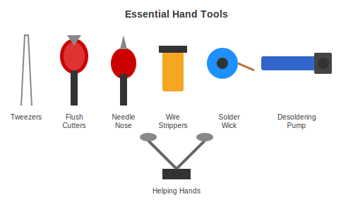

# Hand Tools

The manual tools you will use constantly.



---

## Tweezers

You will use tweezers more than you expect. They hold small components, position parts, and keep your fingers away from hot stuff.

### What to Get

An ESD-safe set with multiple tip styles. The XOOL 9-piece set ($12) covers everything you need.

### The Ones You Will Use Most

- **Straight fine tip** - General use
- **Angled fine tip** - Placing small surface mount components
- **Blunt tip** - Holding wires without damaging them

---

## Cutters

### Flush Cutters

The most important cutter. Cuts wire leads flat against the board instead of leaving a stub.

**Important:** Do not cut hard steel wire with flush cutters. It ruins the blade. These are for component leads and copper wire only.

### Diagonal Cutters

For general cutting when flush cuts do not matter.

---

## Pliers

### Needle-Nose Pliers

For bending component leads, holding wires, and reaching into tight spaces.

### Recommended Set

Dowell 6-piece set ($22) includes flush cutters, diagonal cutters, needle-nose, and other useful pliers.

---

## Wire Strippers

Removes insulation from wire without damaging the conductor.

### Recommended: Self-Adjusting Type (about $12)

Automatically adjusts to wire size. Much easier than manual strippers with specific gauge holes.

---

## Screwdrivers

For opening enclosures and tightening hardware.

### Recommended: JOREST 155 Electric ($30)

Electric screwdriver with a huge bit set. The electric drive saves your wrist when working on lots of screws.

---

## Desoldering Tools

### Solder Wick

Braided copper that absorbs solder. Press it onto a joint with your iron, and the solder wicks up into the braid.

### Desoldering Pump

A spring-loaded sucker. Melt the solder, position the pump, release the spring, and it sucks up the molten solder.

---

## Helping Hands

Holds your board while you solder, freeing both your hands.

### Recommended: 4-Arm Style ($20-25)

The ones with flexible arms and alligator clips work better than the old two-arm style.

---

## Complete Tool List

### Minimum Set (about $45)

```
[ ] Basic tweezer set
[ ] Flush cutters
[ ] Needle-nose pliers
[ ] Wire strippers
[ ] Screwdriver set
[ ] Desoldering pump
```

### Recommended Set (about $90) [What We Use]

```
[ ] XOOL 9-piece tweezers
[ ] Dowell 6-piece pliers set
[ ] Self-adjusting wire stripper
[ ] JOREST electric screwdriver
[ ] Solder wick
[ ] Desoldering pump
[ ] Helping hands
```

---

[Back to Measurement Tools](measurement-tools.md) | [Workstation Setup](workstation-setup.md)
