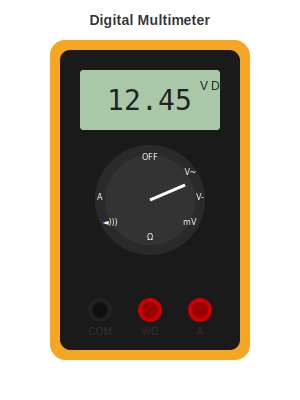

# Measurement Tools

Tools for testing and troubleshooting your circuits.

---

## Multimeter

The most important diagnostic tool. When something does not work, the multimeter helps you figure out why.

### What You Can Do With It

- **Continuity test** - Check if two points are connected (it beeps)
- **Voltage measurement** - Is the power supply working?
- **Resistance measurement** - Is this resistor the right value?
- **Diode test** - Is this LED or diode working?

### Recommended: ANENG AN8009 (about $22)

This budget multimeter does everything a hobbyist needs:
- Auto-ranging (you do not have to select the range)
- True RMS for accurate AC measurements
- Capacitance measurement
- Backlit display

### How to Use It (Quick Version)

**Continuity test:**
1. Set to continuity mode (speaker symbol)
2. Touch probes to two points
3. If it beeps, they are connected

**Voltage measurement:**
1. Set to DC voltage (V with a straight line) or AC voltage (V with a wave)
2. Black probe to ground, red probe to what you are measuring
3. Read the display

We cover this in more detail in [Multimeter Basics](../02-SKILLS/multimeter-basics.md).

---

## Oscilloscope

Shows you signals changing over time. You do not need this to start, but it becomes useful when you are debugging communication protocols or timing issues.

### When You Need One

- Debugging I2C, SPI, or UART communication
- Checking PWM signals
- Analyzing power supply noise
- Any time you need to see what a signal looks like

### Recommended: FNIRSI 1014D (about $90)

A standalone 100MHz oscilloscope that does not need a computer. Good enough for most hobbyist work.

---

## Logic Analyzer

Captures digital signals and decodes protocols. Much cheaper than an oscilloscope if you only need to debug digital communication.

### Recommended: USB Logic Analyzer (about $12)

The cheap 8-channel analyzers work fine with free PulseView software. Great for debugging Arduino and microcontroller projects.

---

## Power Supply

A bench power supply lets you power circuits at different voltages and limit current to protect against shorts.

### Recommended: Korad KA3005D (about $80)

30V, 5A, with voltage and current display. Complete unit ready to use.

---

## What to Buy First

1. **Multimeter** - Get this immediately, it is essential
2. **Power supply** - Very useful but not urgent
3. **Oscilloscope** - When you start doing more complex projects
4. **Logic analyzer** - When you need to debug digital protocols

---

[Back to Soldering Stations](soldering-stations.md) | [Hand Tools](hand-tools.md)
