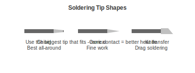

# Soldering Stations

A deeper look at choosing your soldering station.

---

## Why the Station Matters

The soldering station is the one tool where spending more actually makes a noticeable difference. A good station:

- Heats up almost instantly
- Recovers temperature quickly when you touch cold metal
- Feels comfortable in your hand
- Has tips that last

A cheap station:

- Takes forever to heat up
- Temperature drops when you start soldering
- Makes everything harder than it needs to be

---

## The Three Tiers

### Budget: KSGER T12 (about $55)

This is the go-to recommendation for beginners. It uses T12 cartridge-style tips (heater built into the tip) so it heats up fast and recovers quickly.

**Good for:** Learning, occasional use, tight budgets

**Limitations:** Build quality varies, single handle only

### Recommended: Aixun T320 (about $180) [What We Use]

This is what we use every day. It supports two different handle types:
- T245 for general work
- T210 for fine work

Performance is comparable to stations costing twice as much.

**Good for:** Regular hobbyists, anyone who wants quality

### Premium: JBC CD-2BE (about $500)

The industry standard. If you are doing professional repair work or production soldering, this is what the pros use.

**Good for:** Professionals, production work

---

## Temperature Settings

A simple guide:

| Solder Type | Temperature |
|-------------|-------------|
| Leaded (60/40) | 320-350C / 610-660F |
| Lead-free | 370-400C / 700-750F |

Start at the lower end. If solder is not flowing well, increase by 10-20 degrees.

---

## Tip Selection

Tips come in different shapes for different jobs:

- **Chisel** - Best all-around tip, use this most of the time
- **Conical** - For tight spaces and fine work
- **Knife** - For drag soldering (running the tip across multiple pins)

**Rule of thumb:** Use the biggest tip that fits. More contact area means better heat transfer.

---

## Tip Care

Tips last longer if you:

1. Keep them tinned (coated with solder) when not in use
2. Clean them with brass wool, not a wet sponge
3. Do not run them hotter than necessary
4. Never file them (destroys the coating)

---

## Hot Air Stations

A hot air station blows hot air to heat components. Used for:

- Removing surface mount components
- Reflowing solder paste
- Heat shrink tubing
- Loosening adhesive

### Recommended: YIHUA 959D (about $60)

Digital temperature control, adjustable airflow, includes multiple nozzles.

---

## Our Recommendation

**Starting out?** Get the KSGER T12. It is genuinely good and will serve you well.

**Ready to invest?** Get the Aixun T320. You will not need to upgrade again.

---

[Back to Essential Tools](essential-tools.md) | [Measurement Tools](measurement-tools.md)
