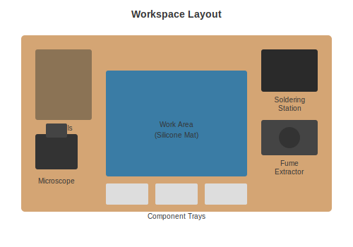

# Workstation Setup

How to organize your workspace for comfortable, safe, and efficient work.

---

## The Basics

You do not need a dedicated room. A corner of a desk works fine. You do need:

- A flat surface to work on
- Good lighting
- Some way to deal with fumes
- A place to put your tools

---

## Workspace Layout



---

## Work Surface

### Silicone Mat

A heat-resistant silicone mat protects your desk and gives you a defined work area. They usually have little compartments to hold screws and small parts.

About $12-18.

---

## Lighting

Good lighting makes everything easier. You need to see what you are soldering.

**Minimum:** A desk lamp pointed at your work area.

**Better:** An LED magnifying lamp that combines light and magnification.

---

## Fume Extraction

Solder flux fumes are not good for you. You have options:

1. **Open a window** - Works but not ideal
2. **Desk fan** - Blows fumes away from your face
3. **Fume extractor** - Pulls fumes through a carbon filter

### Recommended: SainSmart Fume Extractor (about $35)

Sits on your desk and pulls fumes through a filter. Quiet enough to not be annoying.

---

## Organization

### Tool Storage

You want your frequently-used tools within arm's reach. Options:

- Tool roll (portable)
- Desktop organizer
- Rolling cart

### Rolling Cart

A 3-tier rolling cart puts everything at the right height and lets you move your whole setup if needed. About $28-40.

---

## Safety

### Basic Rules

1. **Use fume extraction** when soldering
2. **Wash your hands** after handling solder (especially leaded)
3. **Do not eat or drink** at your workspace
4. **Let things cool** before touching them
5. **Wear safety glasses** when cutting component leads

### ESD Protection

Static electricity can damage sensitive components. If you are working with microcontrollers or other sensitive parts:

- Touch something grounded before handling components
- Better: Use an ESD wrist strap connected to ground
- Best: ESD mat plus wrist strap

---

## Budget Options

### Minimum Setup (about $50)

```
[ ] Silicone mat ($12)
[ ] Desk lamp ($15)
[ ] Open window for ventilation ($0)
[ ] Plastic containers for organization ($10)
[ ] Power strip ($12)
```

### Recommended Setup (about $150)

```
[ ] Silicone mat ($15)
[ ] LED magnifying lamp ($30)
[ ] Fume extractor ($35)
[ ] Rolling cart ($35)
[ ] Helping hands ($22)
[ ] Power strip ($12)
```

---

[Back to Hand Tools](hand-tools.md) | [Additional Tools](additional-tools.md)
