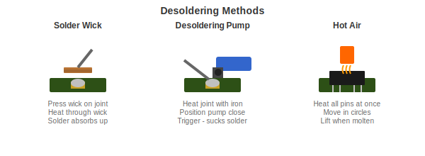

# Desoldering

How to remove components and fix mistakes.

---

## When You Need This

- Fixing a mistake
- Replacing a broken component
- Salvaging parts from old electronics
- Reworking a board

---

## Methods Overview

---

## Method 1: Solder Wick

Best for: Cleaning up joints, removing bridges, surface mount work.

Solder wick is braided copper that soaks up solder like a sponge.

**How to use it:**

1. Add flux to the joint (and to the wick)
2. Place the wick flat on the solder
3. Press your hot iron on top of the wick
4. Wait for solder to absorb into the wick
5. Lift wick and iron together
6. Cut off the used section

**Tips:**
- Flux makes a huge difference
- Press flat for good contact
- Use fresh wick for each joint

---

## Method 2: Desoldering Pump

Best for: Through-hole components.

A spring-loaded sucker that vacuums up molten solder.

**How to use it:**

1. Push the plunger down to load it
2. Heat the joint with your iron until solder melts
3. Position the pump tip right next to the joint
4. Trigger the release
5. Solder gets sucked up
6. Repeat if needed

**Tips:**
- Get the tip as close as possible
- Work quickly after solder melts
- Usually takes 2-3 passes

---

## Method 3: Hot Air

Best for: Surface mount ICs, removing multiple components.

**How to use it:**

1. Add flux to the component
2. Set hot air to 300-350C, low-medium airflow
3. Heat in circular motions (never stay in one spot)
4. Watch for solder to go shiny (it is melting)
5. Lift the component with tweezers when free

**Tips:**
- Use Kapton tape to protect nearby components
- Keep the nozzle moving
- Do not overheat

---

## Removing Through-Hole Components

For things like DIP chips and connectors:

1. Apply flux to all pins
2. Heat and pump each pin
3. When all solder is removed, the component should pull out
4. If stubborn, add fresh solder (to mix alloys) then pump again

---

## Cleaning Up After

1. Wick any remaining solder from pads
2. Clean with isopropyl alcohol
3. Check for damage (lifted pads, burned traces)

---

## When Things Go Wrong

**Lifted pad** - You pulled the copper pad off the board.
- If the trace is visible, you can scrape it and run a wire
- Sometimes you just have to work around it

**Damaged trace** - You broke a copper trace.
- Scrape off soldermask to expose copper on both sides of the break
- Bridge with solder or a small wire

---

## Practice

Find old dead electronics and practice:
- Removing components cleanly
- Getting components out without damage
- Cleaning pads for reuse

This is free practice with no pressure.

---

[Back to SMD Soldering](smd-soldering.md) | [Multimeter Basics](multimeter-basics.md)
