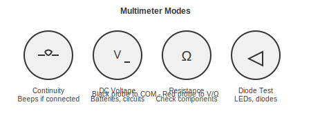

# Multimeter Basics

How to use the most important diagnostic tool in electronics.

---

## What a Multimeter Does

A multimeter measures electrical properties. When something does not work, the multimeter helps you figure out where the problem is.

---

## The Most Useful Functions

### Continuity Test

Checks if two points are electrically connected.

**How to use it:**
1. Set to continuity mode (looks like a speaker symbol)
2. Touch probes to two points
3. If it beeps, they are connected

**Use this for:**
- Checking if a solder joint is actually making contact
- Tracing where wires go
- Finding broken connections
- Checking for shorts (connections that should not exist)

---

### Voltage Measurement

Measures how much electrical pressure is present.

**How to use it:**
1. Set to DC voltage (V with a straight line) for batteries and most electronics
2. Black probe to ground/negative
3. Red probe to what you are measuring
4. Read the display

**Common readings:**
- USB power: 5V
- Arduino logic: 3.3V or 5V
- AA/AAA battery: 1.5V (or less if dead)
- 9V battery: 9V (or less if dead)

---

### Resistance Measurement

Measures how much a component resists current flow.

**How to use it:**
1. Disconnect the component from power (important!)
2. Set to Ohm mode
3. Touch probes across the component
4. Read the display

**Use this for:**
- Verifying resistor values
- Checking if something is shorted (shows 0 or very low)
- Checking if something is open (shows OL or infinity)

---

### Diode Test

Checks if diodes and LEDs are working.

**How to use it:**
1. Set to diode mode (arrow with bar symbol)
2. Red probe to the positive side (anode)
3. Black probe to the negative side (cathode)
4. A working diode shows 0.5-0.7V (silicon) or 1.5-3V (LED)

---

## Troubleshooting Checklist

When your circuit does not work:

1. **Check power**
   - Is there voltage where there should be? (voltage mode)
   - Is ground connected? (continuity mode)

2. **Check for shorts**
   - Power to ground should NOT beep (continuity mode)

3. **Check connections**
   - Are all solder joints actually connected? (continuity mode)

4. **Check components**
   - Are resistors the right value? (resistance mode)
   - Are diodes/LEDs working? (diode mode)

---

## Tips

- Black probe always goes in COM jack
- Red probe goes in V/Ohm jack for most measurements
- Never measure resistance on a powered circuit
- Auto-ranging meters are easier (no need to select range)

---

## Recommended Multimeter

ANENG AN8009 (about $22)
- Auto-ranging
- True RMS
- Does everything a hobbyist needs

---

[Back to Desoldering](desoldering.md) | [Projects](../03-PROJECTS/)
