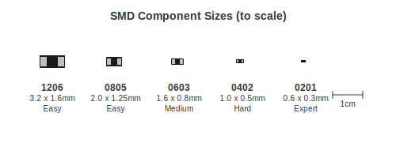
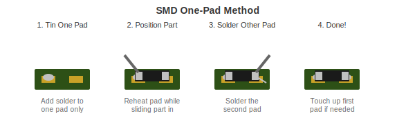

# SMD Soldering

Surface mount components are smaller, but the techniques are learnable.

---

## What is SMD?

SMD (Surface Mount Device) components sit on top of the board instead of going through holes. They are smaller but not as scary as they look.

---

## Component Sizes

SMD parts are named by their size in hundredths of an inch:

| Size | Actual Size | Difficulty |
|------|-------------|------------|
| 1206 | 3.2 x 1.6mm | Easy - start here |
| 0805 | 2.0 x 1.25mm | Easy |
| 0603 | 1.6 x 0.8mm | Medium |
| 0402 | 1.0 x 0.5mm | Hard |
| 0201 | 0.6 x 0.3mm | Expert |

Start with 0805 or 1206. You can hand solder these with basic tools.

---

## Basic Technique: One Pad Method

For two-terminal parts like resistors and capacitors:

1. **Add flux** to both pads
2. **Tin one pad** - Put a small blob of solder on one pad
3. **Hold the component** with tweezers
4. **Reheat the tinned pad** while sliding the component into position
5. **Let it cool** - The component is now held in place
6. **Solder the other pad** normally
7. **Touch up the first pad** if needed

---

## Drag Soldering: For ICs

For chips with multiple pins:

1. **Align the chip** on the pads
2. **Tack two opposite corners** to hold it in place
3. **Add flux** across all pins
4. **Load your tip** with a small amount of solder
5. **Drag across the pins** - The flux helps solder flow only to the pins
6. **Fix any bridges** with flux and a clean tip

---

## Hot Air Method

Using a hot air station:

1. **Apply solder paste** to pads (or flux if reflowing)
2. **Place the component**
3. **Heat with hot air** - Keep the nozzle moving in circles
4. **Watch for reflow** - Solder goes shiny when it melts
5. **Remove heat** and let cool

**Settings:**
- Temperature: 300-350C for most work
- Airflow: Low to medium

---

## Fixing Bridges

If two pins get connected by solder:

1. Add flux across the bridge
2. Clean your tip
3. Drag across the bridge - Solder will stick to the tip
4. Repeat if needed
5. If stubborn, use solder wick

---

## Common Problems

| Problem | Cause | Solution |
|---------|-------|----------|
| Component moves | Not enough solder on first pad | Add more, reheat |
| Tombstoning (one end lifts up) | Uneven heating | Reheat both ends |
| Bridges | Too much solder | Flux and drag, or solder wick |
| Will not stick | No flux, dirty pads | Clean, add flux |

---

## Tools That Help

- **Fine tip** for your iron (T210 handle or equivalent)
- **Angled tweezers** (ESD-15 style)
- **Flux** - Essential for SMD
- **Magnification** - USB microscope or magnifying lamp
- **Solder wick** - For fixing bridges

---

## Practice Progression

1. **1206 resistors** - Big enough to handle easily
2. **0805 components** - Standard hobby size
3. **8-pin SOIC chips** - Practice drag soldering
4. **0603 components** - Need good magnification
5. **Fine pitch ICs** - TQFP and similar

---

[Back to Soldering Basics](soldering-basics.md) | [Desoldering](desoldering.md)
