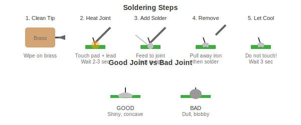
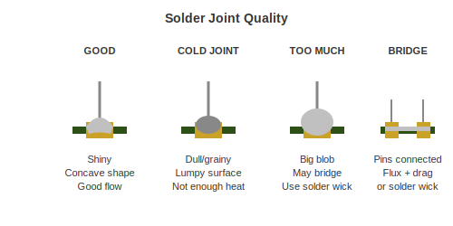

# Soldering Basics

Learn to solder properly. It is easier than you think.

---

## The Core Concept

Soldering is just joining metal parts with melted metal. The trick is getting the parts hot enough that the solder flows onto them and makes a good bond.

**The one thing to remember:** Heat the joint, not the solder. Let the hot joint melt the solder.

---

## The Process

### Step by Step

1. **Clean your tip** - Wipe it on the brass cleaner
2. **Touch the iron to the joint** - Make contact with both the pad and the component lead
3. **Count to 3** - Let the heat transfer
4. **Add solder** - Touch solder to the joint (not the iron tip)
5. **Watch it flow** - Solder should flow onto both surfaces
6. **Remove solder** - Pull solder away
7. **Remove iron** - Pull iron away
8. **Do not touch** - Let it cool for 3 seconds

---

## Temperature

| Solder Type | Temperature |
|-------------|-------------|
| Leaded (60/40, 63/37) | 320-350C / 610-660F |
| Lead-free | 370-400C / 700-750F |

Start with leaded solder. It is much easier to work with.

---

## What Good and Bad Looks Like

A good joint:
- Shiny (leaded) or slightly satin (lead-free)
- Shaped like a small volcano - slopes up to meet the lead
- Solder clearly touches both the pad and the lead
- Smooth surface, no cracks

---

## Flux

Flux cleans the metal surfaces and helps solder flow. Your solder wire probably has flux in the core, but extra flux helps for:

- Reworking old joints
- Surface mount work
- Any time solder is not flowing well

Just dab some flux paste on the joint before soldering.

---

## Tips

### Iron Tips

Use the biggest tip that fits the job. More contact area means better heat transfer.

- **Chisel tip** - Best all-around, use for most work
- **Conical tip** - For tight spaces
- **Knife tip** - For drag soldering

### General Tips

1. **Keep your tip clean and tinned** - Wipe frequently, always store with solder on the tip
2. **Add flux when in doubt** - It almost always helps
3. **Work quickly** - Long heating damages components and pads
4. **Practice on junk first** - Old electronics are free practice material

---

## Common Problems

| Problem | Cause | Solution |
|---------|-------|----------|
| Solder will not stick | Dirty/oxidized surface | Clean with alcohol, add flux |
| Solder balls up | No flux | Add flux |
| Joint looks dull | Not enough heat | Reheat |
| Burnt the board | Too hot, too long | Lower temp, work faster |
| Made a bridge | Too much solder | Solder wick |

---

## Practice Projects

1. **Wire splicing** - Twist two wires together and solder
2. **Header pins** - Solder pins to a microcontroller board
3. **Through-hole kit** - Buy a cheap kit and build it
4. **Salvage practice** - Desolder parts from old electronics

---

## Safety

- Use fume extraction or ventilation
- Wash hands after handling solder
- Do not touch the hot parts
- Wear safety glasses when cutting leads

---

[Back to Equipment](../01-EQUIPMENT/additional-tools.md) | [SMD Soldering](smd-soldering.md)
