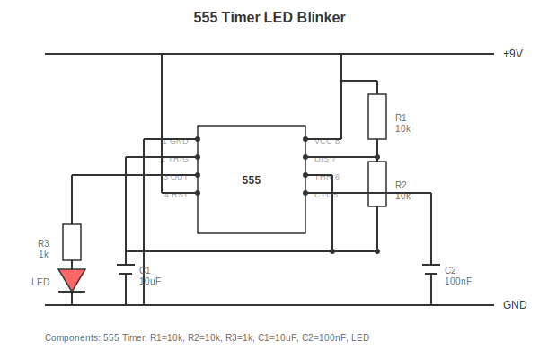
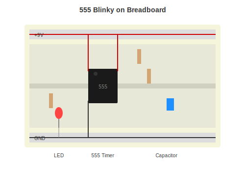

# Project 1: Blinking LED

The "Hello World" of electronics. Make an LED blink on and off.

Difficulty: Beginner
Time: 30-45 minutes

---

## What You Will Build

A simple circuit that blinks an LED using a 555 timer chip. This is the classic first project that teaches:

- How to identify components
- How to follow a circuit diagram
- Basic soldering or breadboard skills

---

## Parts Needed

| Part | What It Looks Like | Approx Cost |
|------|-------------------|-------------|
| 555 Timer IC | Small 8-pin chip | $0.50 |
| LED | Any color, small bulb with legs | $0.10 |
| 10k Resistor (x2) | Tan with Brown-Black-Orange stripes | $0.05 each |
| 1k Resistor | Tan with Brown-Black-Red stripes | $0.05 |
| 10uF Capacitor | Small cylinder with stripe | $0.10 |
| 100nF Capacitor | Small disc marked "104" | $0.05 |
| Breadboard | Board with holes | $3-5 |
| 9V Battery + Clip | Standard battery | $2-3 |
| Jumper wires | Wires with pins | $2-3 |

Total: about $8-10 if buying individually

---

## Schematic

---

## How It Works (Simple Version)

The 555 chip makes the output go high, then low, then high again, over and over. When output is high, the LED lights up. When low, it turns off.

The resistors and capacitor control how fast it blinks.

---

## Breadboard Layout

---

## Building It

### Step 1: Place the 555

Put the chip across the middle gap of the breadboard. Find the notch or dot - that marks pin 1.

### Step 2: Power Connections

- Pin 8 to positive rail (red)
- Pin 1 to ground rail (blue/black)
- Pin 4 to positive rail

### Step 3: Timing Parts

- 10k resistor from positive rail to pin 7
- 10k resistor from pin 7 to pin 6
- Wire from pin 6 to pin 2
- 10uF capacitor from pin 2 to ground (long leg to pin 2)

### Step 4: Small Capacitor

- 100nF capacitor from pin 5 to ground

### Step 5: LED Circuit

- 1k resistor from pin 3
- LED after the resistor (long leg toward resistor)
- LED short leg to ground

### Step 6: Power Up

Connect the 9V battery. LED should blink!

---

## Troubleshooting

| Problem | Check This |
|---------|------------|
| LED does not light | Is LED the right way? Long leg should be toward resistor |
| LED stays on | Check capacitor polarity, check pin 6 to pin 2 wire |
| Nothing happens | Check power connections, check chip orientation |

---

## Make It Different

**Slower blink:** Use 100uF capacitor instead of 10uF

**Faster blink:** Use 1uF capacitor instead of 10uF

**Adjustable speed:** Replace second 10k resistor with a 100k potentiometer

---

## Next Steps

1. Try changing the blink rate
2. Add more LEDs
3. Build [Project 2: Power Supply](project-02-power.md)

---

[Back to Skills](../02-SKILLS/) | [Project 2](project-02-power.md)
