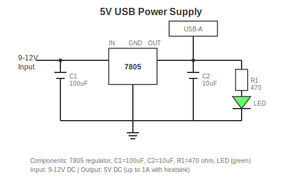
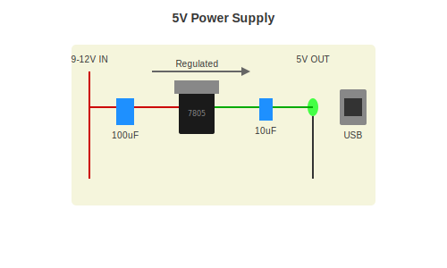

# Project 2: USB Power Supply

Build a regulated 5V power supply - something actually useful.

Difficulty: Easy
Time: 30-45 minutes

---

## What You Will Build

A circuit that takes 9-12V input and outputs clean 5V. You can power Arduino boards, Raspberry Pi Pico, or any 5V device.

---

## Parts Needed

| Part | What It Looks Like | Approx Cost |
|------|-------------------|-------------|
| 7805 Voltage Regulator | Black tab with 3 legs | $0.50 |
| 100uF Capacitor | Cylinder with stripe | $0.20 |
| 10uF Capacitor | Smaller cylinder | $0.10 |
| USB-A Female Connector | The port you plug into | $0.50 |
| Green LED | Small green bulb | $0.10 |
| 470 Ohm Resistor | Yellow-Violet-Brown stripes | $0.05 |
| DC Barrel Jack | Round input connector | $0.50 |
| Heatsink (optional) | Metal fins | $0.50 |

Total: about $5-8

---

## Schematic

---

## How It Works (Simple Version)

The 7805 is a voltage regulator. You put in 7-12V, it outputs exactly 5V. The extra voltage becomes heat (which is why you might need a heatsink).

The capacitors smooth out the power. The LED shows you it is working.

---

## Breadboard Layout

---

## Building It

### Step 1: Test on Breadboard

Before soldering, build it on a breadboard to make sure it works.

1. Put the 7805 on the breadboard
2. Connect 100uF capacitor between input and ground
3. Connect 10uF capacitor between output and ground
4. Apply 9V and measure output - should be 5V

### Step 2: Add LED Indicator

1. 470 ohm resistor from output
2. LED after resistor (long leg toward resistor)
3. LED short leg to ground

LED should light up when powered.

### Step 3: Add USB Connector

- USB pin 1 (leftmost when looking at holes) goes to 5V output
- USB pin 4 (rightmost) goes to ground

### Step 4: Make It Permanent

Once working, solder onto perfboard or make a PCB.

---

## Important Notes

**Heat:** If you draw more than 200mA, add a heatsink to the 7805.

**Input voltage:** Needs at least 7V in, up to 12V is fine. Higher voltage = more heat.

**Max current:** About 1A with good heatsink, 500mA without.

---

## Troubleshooting

| Problem | Check This |
|---------|------------|
| No output | Is input voltage high enough (7V+)? |
| Wrong voltage | Is 7805 the right way around? |
| Gets very hot | Normal if high current, add heatsink |
| LED does not light | Check LED polarity |

---

## Next Steps

1. Add an on/off switch
2. Add more output ports
3. Build [Project 3: Audio Amplifier](project-03-audio.md)

---

[Back to Project 1](project-01-blinky.md) | [Project 3](project-03-audio.md)
