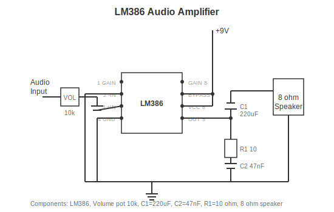

# Project 3: Audio Amplifier

Build a small amplifier to play music through a speaker.

Difficulty: Easy-Medium
Time: 45-60 minutes

---

## What You Will Build

An audio amplifier using the LM386 chip. Plug in your phone or any audio source, and play through a speaker.

---

## Parts Needed

| Part | What It Looks Like | Approx Cost |
|------|-------------------|-------------|
| LM386 Audio Amp IC | 8-pin chip | $0.50 |
| 220uF Capacitor | Larger cylinder | $0.15 |
| 10uF Capacitor | Small cylinder | $0.10 |
| 100nF Capacitor | Small disc "104" | $0.05 |
| 47nF Capacitor | Small disc "473" | $0.05 |
| 10 Ohm Resistor | Brown-Black-Black | $0.05 |
| 10k Potentiometer | Knob with 3 pins | $0.50 |
| 3.5mm Audio Jack | Headphone connector | $0.30 |
| 8 Ohm Speaker | Small speaker | $1-2 |
| 9V Battery | Standard battery | $2 |

Total: about $7-10

---

## Schematic

---

## How It Works (Simple Version)

The LM386 takes a small audio signal and makes it bigger (amplifies it). The potentiometer controls volume. The capacitors block DC and filter the signal.

---

## Building It

### Step 1: Place the LM386

Put the chip on breadboard with notch/dot marking pin 1.

### Step 2: Power

- Pin 6 to +9V
- Pin 4 to ground

### Step 3: Input Circuit

- Audio input through the potentiometer (volume control)
- Potentiometer output to pin 3 through a small capacitor
- Pin 2 to ground

### Step 4: Output Circuit

- Pin 5 to 220uF capacitor (watch polarity)
- Capacitor to speaker positive
- Speaker negative to ground

### Step 5: Stability Components

- 10 ohm resistor and 47nF capacitor in series from pin 5 to ground

---

## Testing

1. Connect audio source (phone, computer) to input jack
2. Connect 9V battery
3. Turn volume up slowly
4. You should hear audio from the speaker!

---

## Troubleshooting

| Problem | Check This |
|---------|------------|
| No sound | Check power, check speaker connection |
| Very quiet | Volume pot wired correctly? |
| Distorted | Turn volume down, check capacitor values |
| Hum/buzz | Keep input wires short, check ground |

---

## Make It Better

**More gain:** Add 10uF capacitor between pins 1 and 8

**Bass boost:** Add 10uF and 10k resistor in series from pin 1 to ground

**Louder:** Use bigger speaker, add second LM386 in bridge configuration

---

[Back to Project 2](project-02-power.md) | [Project Template](project-template.md)
