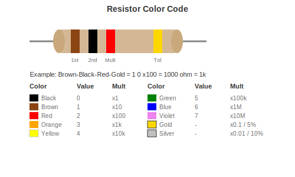
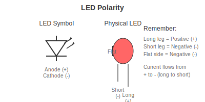

# Component Codes

How to read component values.

---

## Resistor Color Codes

Through-hole resistors have colored bands that tell you their value.

### The Colors

| Color | Value |
|-------|-------|
| Black | 0 |
| Brown | 1 |
| Red | 2 |
| Orange | 3 |
| Yellow | 4 |
| Green | 5 |
| Blue | 6 |
| Violet | 7 |
| Grey | 8 |
| White | 9 |

### How to Read (4-Band Resistors)

First band: First digit
Second band: Second digit
Third band: Multiplier (number of zeros)
Fourth band: Tolerance (gold = 5%, silver = 10%)

### Common Examples

| Colors | Value |
|--------|-------|
| Brown Black Red Gold | 1000 Ohm (1k) |
| Red Red Brown Gold | 220 Ohm |
| Brown Black Orange Gold | 10000 Ohm (10k) |
| Yellow Violet Red Gold | 4700 Ohm (4.7k) |

---

## SMD Resistor Codes

SMD resistors have numbers printed on them.

### 3-Digit Code (5% tolerance)

First two digits are the value, third digit is number of zeros.

| Code | Value |
|------|-------|
| 103 | 10 + 000 = 10000 Ohm = 10k |
| 472 | 47 + 00 = 4700 Ohm = 4.7k |
| 330 | 33 + nothing = 33 Ohm |
| 101 | 10 + 0 = 100 Ohm |

### 4-Digit Code (1% tolerance)

Same idea, first three digits are the value.

| Code | Value |
|------|-------|
| 1002 | 100 + 00 = 10000 Ohm = 10k |
| 4701 | 470 + 0 = 4700 Ohm = 4.7k |

---

## Capacitor Codes

### Ceramic Capacitors (3-Digit Code)

Similar to resistors but the value is in picofarads (pF).

| Code | Value |
|------|-------|
| 104 | 10 + 0000 pF = 100000 pF = 100 nF = 0.1 uF |
| 103 | 10 + 000 pF = 10000 pF = 10 nF |
| 102 | 10 + 00 pF = 1000 pF = 1 nF |
| 101 | 10 + 0 pF = 100 pF |

### Electrolytic Capacitors

Usually marked directly with the value:
- 100uF 25V means 100 microfarads, rated for 25 volts

**Important:** Electrolytic capacitors have polarity. The stripe indicates negative.

---

## LED Polarity

- Longer leg = Positive (Anode)
- Shorter leg = Negative (Cathode)
- Flat side of case = Negative (Cathode)

---

## Diode Polarity

The band marks the negative (cathode) end.
Current flows from positive (no band) to negative (band).

---

## IC Pin Numbering

Pins are numbered counter-clockwise starting from the notch or dot.

Pin 1 is usually marked by:
- A notch at that end of the chip
- A dot near pin 1
- Both

---

[Back to Reference](../04-REFERENCE/) | [Pinouts](pinouts.md)
